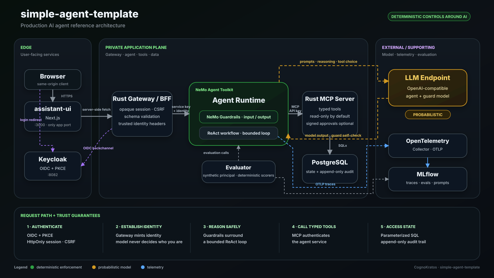

# Production AI Agent Template

A hands-on reference architecture for software engineers learning how to build
**secure, observable and evaluated AI agents**. It is also a real template you
can fork and point at your own domain.

> Agentic AI is software engineering around a probabilistic decision-making
> component. The LLM is an untrusted decision maker: security and authorization
> are enforced deterministically, outside the model.

## Where this fits in CognoKratos

This repository is **Part I — Production Agent Engineering** in the current
[CognoKratos curriculum](https://github.com/cognokratos/.github/blob/main/CURRICULUM.md):
an open-source, community-built curriculum for engineers learning how to build
autonomous systems that can exercise real capabilities without surrendering
security, verifiability or human control.

This is the foundation lab. It teaches how to treat the model as one
probabilistic component inside a larger trust architecture: identity, tool
capabilities, deterministic controls, evaluation, observability and controlled
mutation all live outside the model.

> **Core lesson:** Intelligence does not imply authority.

The repository is a laboratory, not a claim that there is one correct
architecture. Read the [CognoKratos foundation](https://github.com/cognokratos/.github/blob/main/FOUNDATION.md),
follow the structured synthesis in the [CognoKratos Book](https://book.cognokratos.com/part-1/introduction.html),
or help [challenge and extend the curriculum](https://github.com/cognokratos/.github/blob/main/CONTRIBUTING.md).

| I want to… | Go to |
| --- | --- |
| Run it | [Quick start](#quick-start) |
| Learn agentic AI engineering | [Learning path](docs/LEARNING-PATH.md) |
| See one request end to end | [Follow one request](docs/tutorials/REQUEST-WALKTHROUGH.md) |
| Understand the architecture | [Architecture](docs/ARCHITECTURE.md) |
| Build my own agent | [Extending the template](docs/EXTENDING.md) · [Labs](docs/tutorials/README.md) |
| Study the security model | [Security](docs/SECURITY.md) · [Trust boundaries](docs/concepts/07-security-and-trust-boundaries.md) |
| Learn evaluation | [Evaluation](docs/EVALUATION.md) · [Concept](docs/concepts/05-evaluation.md) |
| Debug agent execution | [Observability](docs/OBSERVABILITY.md) · [Lab: traces](docs/tutorials/06-debug-with-traces.md) |



The architecture is deliberately asymmetric: deterministic software controls identity,
authorization, tool access and state, while the LLM remains the single probabilistic
decision-making component inside those boundaries.

assistant-ui is the only application service reachable from the browser. The
gateway, NAT, MCP and the database publish no host ports and sit on segmented
networks. Any OpenAI-compatible model endpoint works; the defaults target a
local Ollama.

The sample application triages customer-support tickets for a fictional online
shop and is **read-only** by default. Everything that is not the sample is
meant to be reused unchanged — see [docs/EXTENDING.md](docs/EXTENDING.md).

## Three ways to use this repository

| Path | Question | Start with |
| --- | --- | --- |
| **LEARN** | "Teach me how production AI agents work." | [Learning path](docs/LEARNING-PATH.md) → [concepts](docs/README.md#learn-teach-me-how-production-ai-agents-work) → [labs](docs/tutorials/README.md) |
| **BUILD** | "Help me adapt this template to my domain." | [EXTENDING.md](docs/EXTENDING.md) → [Lab 10](docs/tutorials/10-build-your-own-domain-agent.md) → [challenges](docs/CHALLENGES.md) |
| **REFERENCE** | "Tell me precisely how this implementation works." | [Reference manual](docs/README.md#reference-tell-me-precisely-how-this-implementation-works) |

## Quick start

**Resources.** The full stack runs several services at once: assistant-ui,
the gateway, Keycloak, PostgreSQL, the MCP server, the agent with its
guardrails, the OpenTelemetry Collector and MLflow. Presidio's PII analyzer,
used by output masking, has a large memory footprint of its own. On a Docker VM
of about 8 GB, there may not be enough headroom to run MLflow and PII masking
together for every exercise. If you see truncated streams, agent restarts or
`exit 137` during masking, read
[LIMITATIONS.md — resource requirements](docs/LIMITATIONS.md#resource-requirements).

```bash
make env          # create .env from .env.example
make pull-models  # no-op unless LLM_BASE_URL is an Ollama endpoint
make dev          # build and start everything
make wait         # readiness
make open-ui      # http://localhost:3000
```

Sign in with `agent` / `agent`. Then try:

```
Show me the open support tickets
Which ticket should we handle first, and why?
Summarize ticket TKT-1003 and its history
```

The prioritization prompt needs the agent to reason over several tickets at
once, which is more than the shipped default model, `qwen3:8b`, reliably
manages — see [docs/CONFIGURATION.md#model-endpoint](docs/CONFIGURATION.md#model-endpoint)
for what was observed and a tested alternative. The other two prompts are
single-tool and answer reliably on the default.

Changing a ticket's priority ("Mark it as high priority") is disabled by
default: the sample application ships read-only. To try the human-approval
flow, opt in per [docs/APPROVALS.md](docs/APPROVALS.md) — in short, uncomment
the `functions:` block in `agent/config.yml`, add `ticket_priority_change` to
`workflow.tool_names`, and set `HITL_APPROVAL_SECRET` and
`HITL_ENABLE_INTERACTIVE=true`. With that enabled, asking to change a ticket's
priority shows an approval card requiring a human decision and, for any actual
change, a typed reason; the choice is bound to a signed token, verified and
applied by the MCP server in one transaction, and recorded in `ticket_audit`.

## What this template gives you

| | |
| --- | --- |
| **Authentication** | Keycloak OIDC with PKCE, server-side tokens, opaque sessions, CSRF, strict cookie attributes |
| **Isolation** | Seven Compose networks, one per trust relationship, asserted statically *and* at runtime |
| **Guardrails** | NeMo input self-check with deterministic override layers; streaming secret blocking; configurable PII masking |
| **Observability** | One trace per request covering the agent run *and* the guardrail decisions, with readable question/answer and credential redaction |
| **Evaluation** | Four MLflow suites with deterministic scorers, latency distributions, and provenance linking every result to the agent that produced it |
| **Approvals** | An optional, opt-in signed-approval boundary for state-changing actions — off by default |
| **Learning layer** | A [learning path](docs/LEARNING-PATH.md), eight concept pages, an [end-to-end request walkthrough](docs/tutorials/REQUEST-WALKTHROUGH.md), ten [labs](docs/tutorials/README.md) and [challenges](docs/CHALLENGES.md), all grounded in this code and checked by `make docs-check` |

## Documentation

The full map, organised by the three paths above, is in
[docs/README.md](docs/README.md). The existing reference-document structure is
preserved, and the learning material links into it. A few reference documents
were corrected where the educational review exposed drift.

## Contribute to the curriculum

CognoKratos contributions are not limited to feature work. A useful contribution
can be a reproducible failure, a stronger threat model, an adversarial test, an
alternative architecture, a new lab or a better explanation of a trade-off.
Reference architectures are propositions to inspect and challenge.

See the organization-level [contribution model](https://github.com/cognokratos/.github/blob/main/CONTRIBUTING.md)
for how project improvements can feed back into the living curriculum.

## Verify it

```bash
make static-check   # no Docker, no cluster, no model
make test           # everything, with the cluster up
make security-test  # authentication and topology boundaries
make eval-all       # the evaluation suites; needs a model
make docs-check     # documentation links, anchors and make targets (part of static-check)
```

`make help` lists every target.

## Repository layout

| Path | |
| --- | --- |
| `ui/` | assistant-ui on Next.js |
| `gateway/` | Rust backend-for-frontend: OIDC, sessions, CSRF, proxying |
| `agent/` | NAT workflow, guardrail middleware, observability, optional approvals |
| `mcp-server/` | Rust MCP tools over PostgreSQL, and the approval verifier |
| `evaluation/` | MLflow suites, deterministic scorers, provenance |
| `db/`, `keycloak/`, `observability/` | Schema and seed data, realm generation, collector config |
| `scripts/` | Checks that run without the cluster, and trace tooling |
| `docs/` | [Learning path](docs/LEARNING-PATH.md), [concepts](docs/concepts/), [labs](docs/tutorials/), and the reference manual |

## Notes

**NAT ReAct prompt compatibility.** The custom `system_prompt` must contain the
`{tools}` and `{tool_names}` placeholders. NAT replaces them at startup with the
discovered MCP tool descriptions and names.

**No site-packages are modified.** Earlier revisions patched installed NAT and
Guardrails code at image-build time. That is now application code reached
through supported extension points, with regression suites proving the behaviour
it replaced. Where private NAT attributes are still relied on, they are named
with their removal conditions in
[OBSERVABILITY.md](docs/OBSERVABILITY.md).

**Dependencies.** NAT's supported `react_agent` lives in the NAT LangChain
plugin. 1.9 split that plugin's provider integrations into optional extras, so
this installs `nvidia-nat-langchain[openai]` rather than the complete set —
29 fewer packages than 1.8 required, including boto3, the OCI SDK, LiteLLM,
Milvus and HuggingFace. The compiler needed by `annoy` stays in the builder
stage.

**Licensing.** Original code and documentation are MIT licensed
([LICENSE](LICENSE)). Three agent files derived from NVIDIA NeMo Agent Toolkit
keep Apache-2.0 and NVIDIA's notices; see
[THIRD_PARTY_NOTICES.md](THIRD_PARTY_NOTICES.md) and
[LIMITATIONS.md](docs/LIMITATIONS.md#licensing).
