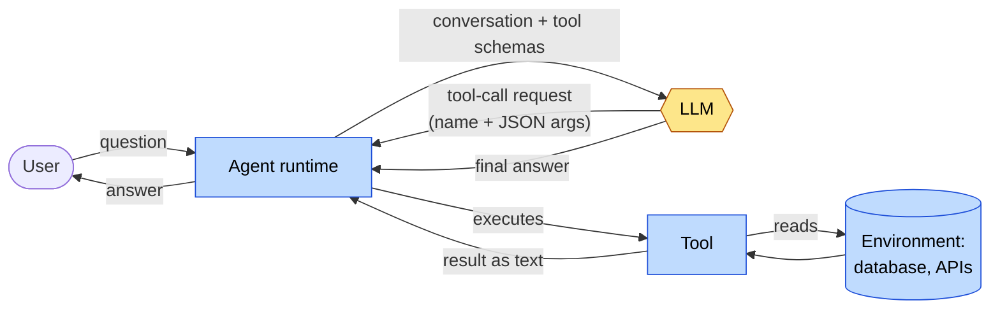
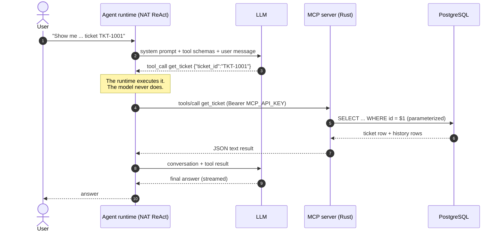

# 1. The LLM, the agent, and the agent loop

> Agentic AI is software engineering around a probabilistic decision-making
> component.

This page covers learning-path stages 0 and 1. It explains what the model is,
what an agent adds around it, and how the loop in this repository runs.

## The LLM is a probabilistic component

Treat the model like an unreliable remote service whose output is a *sample*,
not a return value:

| Property | What it means for engineering |
| --- | --- |
| Non-deterministic | The same prompt can produce different answers. `temperature: 0.0` in [`agent/config.yml`](../../agent/config.yml) narrows the spread but does not make output reproducible across model versions, hardware or providers. |
| Untyped output | It emits text (or a structured tool-call request). Anything downstream must parse and validate it. |
| Stateless | It remembers nothing between calls. Every call includes the whole conversation (bounded here by `max_history: 20`). |
| No access to your systems | It knows only its training data and what you put in the prompt. It cannot see your database. |
| Fluent when wrong | A wrong answer is as confident and well-formatted as a right one. |

Two consequences shape everything else in this repository:

1. **You cannot unit-test a model into correctness.** You *measure* it with
   evaluations ([concept 5](05-evaluation.md)) and *observe* it with traces
   ([concept 6](06-observability.md)).
2. **You cannot let it hold authority.** Identity, authorization and state
   changes are enforced by deterministic code that does not depend on what the
   model said ([concept 7](07-security-and-trust-boundaries.md)).

The split this repository is built around:

| Probabilistic: the model decides | Deterministic: code enforces |
| --- | --- |
| interpreting the request | authentication (Keycloak, gateway sessions) |
| planning and reasoning | authorization and the allowed capability surface |
| which tool to call, with which arguments | tool input schemas and parameterized SQL |
| natural-language generation | output regex blocking, PII masking |
| recommendations | policy evaluation, approval-token verification |
| | database constraints, append-only audit records |
| | evaluation assertions, network boundaries |

## What an agent is

An **agent** is a program that uses an LLM to decide its *next action* in a
loop, executes that action through code it controls, and feeds the result back
to the model until the model produces a final answer.

The LLM never executes anything. It produces a *request*: "call `get_ticket`
with `{"ticket_id": "TKT-1001"}`". The **agent runtime** decides whether to
honour that request, executes it, and returns the result as more input.

### Diagram A: the agent mental model

Yellow is probabilistic, blue is deterministic. The model sits *inside* a loop
that ordinary code owns.

| Concept | Implementation in this repo |
| --- | --- |
| Agent runtime | NeMo Agent Toolkit (NAT) `streaming_react_agent` workflow, [`register.py`](https://github.com/cognokratos/simple-agent-template/blob/main/agent/src/nat_streaming_react/register.py) |
| LLM | Any OpenAI-compatible endpoint (`llms.primary` in [`agent/config.yml`](../../agent/config.yml)); default `qwen3:8b` on a local Ollama |
| Tools | Two read-only MCP tools, `search_tickets` and `get_ticket`, in [`mcp-server/src/main.rs`](../../mcp-server/src/main.rs) |
| Environment | PostgreSQL, schema in [`db/init.sql`](../../db/init.sql) |

## ReAct and native tool calling

**ReAct** ("reason + act") is the loop pattern: the model alternates between
reasoning about what to do and requesting an action, and each observation
(tool result) informs the next step.

Early ReAct implementations ran over plain text. The model wrote
`Action: get_ticket` / `Action Input: {...}` / `Final Answer: ...` and a parser
extracted them with regexes. **Native tool calling** moves this into the model
API: the tool schemas go into the request as structured definitions, and the
model returns a structured `tool_calls` field instead of prose to be parsed.

This repository uses NAT's ReAct graph with `use_native_tool_calling: true`.
Native calling removes a class of parse failures. It also changed streaming:
NAT's stock stream waits for the literal `Final Answer:` marker, which native
calling never emits. That is why
[`register.py`](https://github.com/cognokratos/simple-agent-template/blob/main/agent/src/nat_streaming_react/register.py) exists (see
[EXTENDING.md](../EXTENDING.md#what-each-local-module-compensates-for)).

### Diagram B: one tool-calling turn

This is what happens for *"Show me the complete details and history for ticket
TKT-1001"*, as observed in a live trace (see the
[request walkthrough](../tutorials/REQUEST-WALKTHROUGH.md)):

## The loop is bounded by configuration

An unbounded loop around a probabilistic component is an outage waiting to
happen. The bounds live in `workflow:` in
[`agent/config.yml`](../../agent/config.yml):

| Setting | Value | What it bounds |
| --- | --- | --- |
| `max_tool_calls` | `20` | Loop iterations. `register.py` turns it into a LangGraph `recursion_limit` of `(max_tool_calls + 1) * 2`. When it is hit, the user gets "The agent could not produce a final answer within 20 tool calls" instead of a hang. |
| `max_history` | `20` | Messages carried into each model call |
| `tool_call_max_retries` | `2` | Retries of a failing tool call |
| `parse_agent_response_max_retries` | `3` | Retries when the model's output cannot be parsed |
| `pass_tool_call_errors_to_agent` | `true` | A tool error becomes an *observation* the model can explain, not a crash. Try `TKT-9999` (scenario 4 in [TEST-SCENARIOS.md](../TEST-SCENARIOS.md#4-tool-error-handling)). |
| `request_timeout` / `max_retries` (under `llms.primary`) | `300.0` / `2` | Each model call |
| `tool_call_timeout` (under `function_groups.tickets_mcp`) | `30` | Each MCP call |

## The system prompt is configuration, not a control

The `system_prompt` in [`agent/config.yml`](../../agent/config.yml) tells the
model how to use the tools, to ground every factual statement, and to treat
ticket text as untrusted data. It is worth writing carefully, because it
measurably changes behaviour. It is **not** a security boundary. A prompt is a
request to a probabilistic component, and the evaluation suites exist because
"the prompt says not to" is not evidence that it doesn't. See
[ANTI-PATTERNS.md](ANTI-PATTERNS.md#treating-prompts-as-authorization).

## When not to use an agent

If the sequence of steps is known in advance, write it as code. An agent pays
for flexibility with latency, cost and non-determinism. That trade is worth it
when the *path* depends on interpreting natural language ("what's going on with
this customer's orders?"). It is not worth it for "every night, export open tickets to
CSV", and not for any single decision with an explicit rule, such as ranking
tickets by priority ([concept 3](03-grounding-and-authoritative-state.md#grounded-is-not-the-same-as-correct)).
See [ANTI-PATTERNS.md](ANTI-PATTERNS.md#overusing-agents-for-deterministic-workflows).

## On the Rig implementation

The same concept, without the toolkit. On
[`rust-agent`](https://github.com/cognokratos/simple-agent-template/tree/rust-agent)
the loop is Rig's agent runner over a small, serialisable state machine
(`AgentRun`: call the model, call tools, done). A Rig agent is assembled **per
request** in [`builder.rs`](https://github.com/cognokratos/simple-agent-template/blob/rust-agent/agent/src/agent/builder.rs), and
[`execution.rs`](https://github.com/cognokratos/simple-agent-template/blob/rust-agent/agent/src/agent/execution.rs) walks one request through every step,
labelling each decision probabilistic or deterministic. Native tool calling
streams without any `Final Answer:` workaround. The loop is bounded twice: Rig's
model-call budget (`max_tool_calls + 1`) and a deterministic tool-call budget in
the dispatch hook, so the limit means exactly `max_tool_calls` tool calls.

What NAT gives you here is a configurable graph; what Rig makes explicit is the
loop itself. In both, the loop is where the model *decides*, never where
authority is *granted*. → [Rust lesson 03](../RUST-LEARNING-PATH.md#03--understand-the-agent-loop),
[NAT vs Rig](../NAT-VS-RIG.md#the-agent-loop)

## Go deeper

* Lab: [01 — Run the agent](../tutorials/01-run-the-agent.md),
  [02 — Understand tool calling](../tutorials/02-understand-tool-calling.md)
* Walkthrough: [Follow one request](../tutorials/REQUEST-WALKTHROUGH.md)
* Reference: [ARCHITECTURE.md](../ARCHITECTURE.md),
  [CONFIGURATION.md — model endpoint](../CONFIGURATION.md#model-endpoint)
* Next concept: [2. Tools and MCP](02-tools-and-mcp.md)
