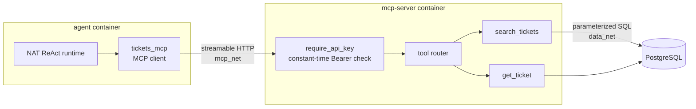

# 2. Tools, MCP and capability boundaries

> A tool is an externally implemented capability exposed to the model through a
> typed interface. The model can request an invocation. It does not execute the
> capability itself.

This page covers learning-path stages 2 and 3.

## A tool is an API you design for an unreliable caller

From the runtime's side, a tool is a function with a name, a description and a
JSON Schema for its input. The model sees the name, the description and the
schema, and nothing else. It decides when to call the tool and what arguments to
pass based on the text you wrote.

That makes tool design API design, with an unusual client: it is fluent, often
correct, occasionally wrong, cannot read your source code, and might be
manipulated by text it read a moment ago. Design for that client:

| API-design concern | How it shows up with a model as the caller | In this repo |
| --- | --- | --- |
| Typed inputs | The schema is the only contract the model sees, so validate every input. | `SearchTicketsArgs` / `GetTicketArgs` in [`mcp-server/src/main.rs`](../../mcp-server/src/main.rs), derived with `schemars::JsonSchema` |
| Narrow capabilities | Each tool is a *permission*. The model can do whatever the union of its tools can do. | Two read-only tools. No `run_sql`, no update tool. |
| Bounded results | The model pays (in latency and context) for every byte you return. | `limit` defaults to 50 and is clamped to `1..=100` |
| Errors as data | An error the model can read becomes an observation it can explain. | Unknown ticket → `invalid_params` "Ticket 'TKT-9999' was not found" |
| Descriptions are documentation | The description is where you tell the model *when* to call a tool. | `#[tool(description = ...)]` in Rust, overridden by `tool_overrides` in [`agent/config.yml`](../../agent/config.yml) |
| Granularity | Too fine-grained and the model must chain many calls. Too coarse and you lose least privilege. | `search_tickets` returns priority and `created_at`, so prioritization *can* be answered without fan-out (see below) |

### The tool cannot be talked out of its own rules

The SQL in `get_ticket` is parameterized:

```rust
sqlx::query_as::<_, TicketDetail>(
    r#"
    SELECT id, subject, status, priority, description, customer_name,
           order_reference, assigned_to, created_at, updated_at
    FROM tickets
    WHERE id = $1
    "#,
)
.bind(ticket_id)
```

Whatever the model puts in `ticket_id`, it is bound as a value and never
interpreted as SQL. The model chooses *which* ticket. The code decides *what
kind of operation* is possible. That division (model picks arguments, code
fixes the operation) is the core of tool design.

## MCP: tools as a protocol

The **Model Context Protocol (MCP)** standardizes how an agent discovers and
calls tools hosted in another process. Instead of linking tool code into the
agent, the agent is an MCP *client*: it asks the server for its tool list
(`tools/list`) and invokes tools over the protocol (`tools/call`).

| Concept | Implementation in this repo |
| --- | --- |
| Tool interoperability | MCP over streamable HTTP |
| MCP server (capability implementation) | Rust, [`rmcp`](https://github.com/modelcontextprotocol/rust-sdk), [`mcp-server/src/main.rs`](../../mcp-server/src/main.rs) |
| MCP client | NAT's `mcp_client` function group `tickets_mcp` in [`agent/config.yml`](../../agent/config.yml) (Rig: `rmcp` + `rig-rmcp`, see below) |
| Which tools the agent may use | `include: [search_tickets, get_ticket]` in that function group |
| Service-to-service authentication | `Authorization: Bearer ${MCP_API_KEY}`, checked in constant time by `require_api_key` |
| Persistence | PostgreSQL, reachable **only** from the MCP server (`data_net`) |

Why a separate process and protocol, rather than Python functions inside the
agent?

* **A process boundary is a capability boundary.** The agent container holds no
  database credentials and is not on the database network. Everything the agent
  can do to PostgreSQL goes through the two operations the MCP server
  implements. See [ARCHITECTURE.md — network segmentation](../ARCHITECTURE.md#network-segmentation).
* **Independent language, deployment and review.** The capability code is Rust
  with typed rows and compiled queries. It can be reviewed and tested without
  any AI tooling (`cd mcp-server && cargo test`).
* **Reuse.** Any MCP client (MCP Inspector, another agent, an IDE) can use the
  same server, through the same authentication.



## Tool descriptions are prompts

The tools carry descriptions in two places:

1. In Rust, `#[tool(description = "...")]`. This is what any MCP client sees.
2. In `tool_overrides` in `agent/config.yml`. NAT replaces the description the
   model sees with this one.

The override for `get_ticket` says: *"When the user asks for history across
multiple tickets, call this tool separately once for every ticket ID returned by
search_tickets."* This is behavioural instruction delivered through the tool
interface. It changes model behaviour as much as the system prompt does, and it
must be evaluated the same way (the `tools` suite in
[EVALUATION.md](../EVALUATION.md#suites)).

## When agent problems are API-design problems

*"Show the history for all open tickets"* needs one `search_tickets` call plus one
`get_ticket` per open ticket. That is 6 calls for the 5 seeded open tickets, each
a full model round trip. This is an N+1 query pattern, and the model is the one
issuing it.

Observed on the default `qwen3:8b` (every run made while writing the labs, on two
agent builds, and in the `tools` evaluation suite, see
[lab 04](../tutorials/04-break-the-agent.md#experiment-2-tool-call-explosion)):
the model called `search_tickets`, then `get_ticket` for only **three of the
five** open tickets, and ended without a usable answer. Every call it made was
correct. The trajectory was incomplete.

You can push on the prompt, or switch to a stronger model (see
[CONFIGURATION.md](../CONFIGURATION.md#qwen38b-and-the-prioritization-prompt)).
Or you can recognise this as an API shape problem: a `get_tickets_history(status)`
tool, or a `history` option on `search_tickets`, turns six round trips into one
and removes the place where the model can lose count. A bounded, server-side
operation is cheaper, faster and more reliable than a model-driven loop. Trading
generality for reliability is the right call more often than people expect.

The prioritization prompt shows the same lesson from another side. The system
prompt already tells the model that `search_tickets` includes priority and
`created_at`, so no fan-out is needed, and good API design gave the model what
it needed in one call. Even so, depending on the agent build, the default model
either reasoned wrongly from that one call or fanned out anyway and never
answered (see
[concept 3](03-grounding-and-authoritative-state.md#grounded-is-not-the-same-as-correct)).
If the ranking rule is deterministic, a tool that returns the ranking removes
both failure modes.

## Tool-call budgets

Every tool call costs a model round trip. The defences are layered:

| Control | Where | Effect |
| --- | --- | --- |
| `max_tool_calls: 20` | `workflow` in `agent/config.yml` | Hard ceiling on loop iterations |
| `tool_call_timeout: 30` | `function_groups.tickets_mcp` | Per-call ceiling |
| `limit` clamp `1..=100` | `search_tickets` in Rust | Bounded result size, whatever the model asks for |
| Tool granularity | your API design | Fewer calls needed in the first place |

## What this repository does not do

* **No dynamic tool loading.** The agent uses exactly the tools listed in
  `include`. Adding a tool to the MCP server does nothing until it is also added
  there. That is deliberate: the capability surface is reviewed configuration.
* **No per-user authorization in the tools.** The MCP tools return any matching
  row. Scoping queries to the user is listed under "before production" in
  [LIMITATIONS.md](../LIMITATIONS.md#before-production). The identity *is*
  available to the agent (concept 7); passing it to tools and enforcing it in SQL
  is a domain decision.
* **No RAG.** Retrieval-augmented generation (vector search over documents) is
  another way of supplying context to a model. This repository supplies context
  through typed, exact-match tools over authoritative records, because ticket
  state is structured data with a single source of truth. If your domain has
  unstructured knowledge (manuals, policies), retrieval becomes another tool with
  the same design concerns.

## On the Rig implementation

The capability boundary is the same Rust MCP server with the same tools; only
the client differs. The Rig agent discovers tools over `rmcp` 2.2 at startup
and invokes them through `rig-rmcp` ([`mcp/client.rs`](https://github.com/cognokratos/simple-agent-template/blob/rust-agent/agent/src/mcp/client.rs)), with
the same allow-list and description overrides from `agent/config.yml`. Two
things are stricter there:

* a tool whose published schema uses a keyword the agent cannot enforce, or
  declares an argument such as `user_id` or `approval_token`, **stops startup**
  ([`mcp/schema.rs`](https://github.com/cognokratos/simple-agent-template/blob/rust-agent/agent/src/mcp/schema.rs));
* every proposed call passes one deterministic policy function before it runs
  — closed registry, no unknown arguments, no type coercion
  ([`guardrails/tools.rs`](https://github.com/cognokratos/simple-agent-template/blob/rust-agent/agent/src/guardrails/tools.rs)).

The MCP server still re-validates every argument and remains authoritative.
→ [Rust lessons 04–06](../RUST-LEARNING-PATH.md#04--discover-tools-through-mcp)

## Go deeper

* Lab: [02 — Understand tool calling](../tutorials/02-understand-tool-calling.md),
  [03 — Add an MCP tool](../tutorials/03-add-an-mcp-tool.md)
* Reference: [EXTENDING.md](../EXTENDING.md),
  [SECURITY.md — service credentials](../SECURITY.md#service-credentials)
* Source: [`mcp-server/src/main.rs`](../../mcp-server/src/main.rs),
  `function_groups` in [`agent/config.yml`](../../agent/config.yml)
* Next concept: [3. Grounding and authoritative state](03-grounding-and-authoritative-state.md)
