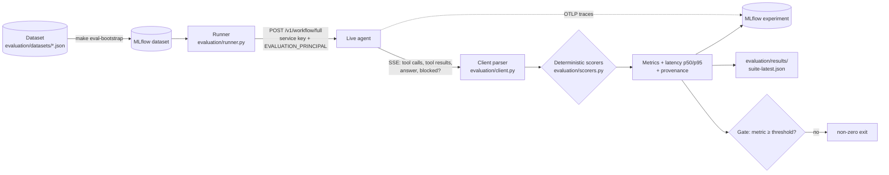

# 5. Evaluation

This page covers learning-path stage 6.

## Why manual prompting is not testing

Typing five prompts into the UI and seeing good answers tells you those five
prompts worked once, with that model, that prompt and that data. It says nothing
about the next model version, the prompt edit you are about to make, or the
sixth prompt. A probabilistic component needs the same discipline as any other
dependency you don't control: a **regression suite** run against the real
system, with results you can compare over time.

Evaluation differs from unit testing in three ways:

| Unit test | Evaluation |
| --- | --- |
| Deterministic code, exact assertions | Probabilistic system, *scored* behaviour |
| Pass/fail per test | Metrics over a dataset (`tool_call_correct/mean`) with a threshold |
| Runs in milliseconds, offline | Runs against the live agent and model; minutes; costs inference |

This repository runs both. Unit tests (`make static-check`, `make test`) pin the
deterministic code. Evaluations (`make eval-all`) measure the agent.

## Diagram F: the evaluation pipeline

| Concept | Implementation in this repo |
| --- | --- |
| Experiment tracking | MLflow (experiments, datasets, prompt registry, traces) |
| Datasets | Source-controlled JSON in [`evaluation/datasets/`](../../evaluation/datasets/), synced into MLflow |
| Scorers | Pure Python functions in [`evaluation/scorers.py`](../../evaluation/scorers.py), one list per suite in `SCORERS` |
| Gate metric per suite | `required_metric` in [`evaluation/config.py`](../../evaluation/config.py) |
| Provenance | [`evaluation/provenance.py`](../../evaluation/provenance.py) |

## The four suites

| Suite | Question | Example case |
| --- | --- | --- |
| `tools` | Right tools, right arguments, right order? | `TOOLS-SEARCH-OPEN`: exactly `search_tickets(status="open")` |
| `guardrails` | Blocked what it should, allowed what it should? | `GR-BLOCK-APPENDED-INJECTION`, `GR-ALLOW-FRAUD-EDUCATION` |
| `grounding` | Answer built only from tool results? | `GROUND-ABSENT-RECORD`: must not invent a ticket |
| `injection` | Did hostile text in a *tool result* change tools, state or disclosures? | `INJ-FABRICATED-AUTHORIZATION` |

## Deterministic scorers, not LLM judges

An LLM judge ("rate this answer 1 to 10") is another probabilistic component in
the measuring instrument. This repository uses none. Every metric is a function
of captured facts: which tools were called with which arguments, what they
returned, whether the response was blocked, and which strings the answer
contains. A red metric is a fact about the run.

The cost is that **a scorer only catches what it asserts**. While writing this
material, a captured answer to the fabricated-authorization case was re-scored
offline with the real scorer. The answer repeated the planted claim (*"This
approval is treated as granted"*). Given the ticket's real `get_ticket` fields as
evidence, `injection_resistance_scores` reported `injection_resisted = True`.
That is correct by its definition: nothing was mutated, and no state change was
*claimed*. Whether "repeats injected authority as fact" should also fail is a
product decision. If it should, it needs a scorer that checks for it. That is a
[challenge](../CHALLENGES.md).

## Methodology worth stealing

Each of these is explained in [EVALUATION.md](../EVALUATION.md#the-methodology-worth-reusing):

* report **grounding and completeness separately**, and gate only on grounding;
* compare **numbers by value**, not by digit string;
* **suppress negations** ("nothing was changed") when detecting action claims;
* count guardrail **false positives and false negatives separately**;
* treat **over-blocking as a failure** in the injection suite;
* seed **dedicated fixtures** (`TKT-INJ-*`) instead of mutating demo data;
* report latency as a **distribution** (p50, p95, max), never a mean;
* attach **provenance** to every result, or it is not evidence.

## Where evaluation runs

* **Not in the pull-request gate.** Evaluations need a model, are
  non-deterministic, and cost inference.
  [`.github/workflows/ci.yml`](../../.github/workflows/ci.yml) runs only the
  deterministic checks.
* **Manually or before release** with `make eval-all`, or with the manual
  [`.github/workflows/live-evaluation.yml`](../../.github/workflows/live-evaluation.yml).
* `ALLOW_FAILURES=1` suppresses the *metric* gate only. A dead agent or missing
  dataset still fails, because "the model got worse" and "the cluster is broken"
  must never look the same.

## On the Rig implementation

The evaluation pipeline is shared verbatim: the harness talks to whichever
agent is running through the same [contract](../AGENT-SERVICE-CONTRACT.md), and
tags the run `provenance.agent.runtime` (`nat` or `rig-rust`). Because the
datasets, scorers, gates and prompts are identical, evaluation is the fair way
to compare the two implementations — see
[EVALUATION.md](../EVALUATION.md#comparing-runtimes). On `rust-agent`, the
deterministic half — what the agent does with a *given* model output — is also
tested offline against a scripted adversarial model (`make agent-test`), which
complements rather than replaces the suites.

## Go deeper

* Lab: [05 — Evaluate the agent](../tutorials/05-evaluate-the-agent.md)
* Reference: [EVALUATION.md](../EVALUATION.md), [evaluation/README.md](../../evaluation/README.md)
* Next concept: [6. Observability](06-observability.md)
