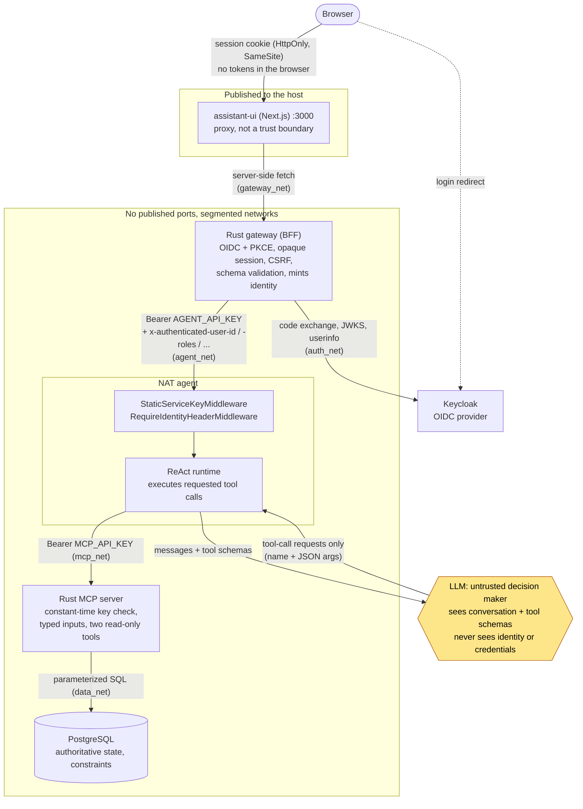

# 7. Authentication, identity and trust boundaries

This page covers learning-path stage 8.

> The LLM is an untrusted decision maker. Security and authorization must be
> enforced deterministically outside the model.

## Threat model in one paragraph

Assume the model can be persuaded to request anything its tools allow. Prompt
injection, a confused model and a malicious user typing cleverly all lead to the
same place: **the tool calls the model requests are attacker-influenced input.**
So the security question is never "will the model behave?" It is "what is the
worst thing the model could cause, given the capabilities and identity it
holds?" Then you make that answer acceptable with deterministic controls.

## Diagram D: trust boundaries



The model's only output is "tool-call requests" back to the runtime. The
runtime makes the call to MCP, with `Bearer MCP_API_KEY`, which the model never
sees. The model only supplies the tool name and arguments.

| Concept | Implementation in this repo |
| --- | --- |
| Authentication | Keycloak OIDC, Authorization Code + PKCE, run entirely by the gateway ([`gateway/src/oidc.rs`](../../gateway/src/oidc.rs), [`auth.rs`](../../gateway/src/auth.rs)) |
| Session | Opaque, server-side, generation-checked ([`gateway/src/session.rs`](../../gateway/src/session.rs)) |
| Identity propagation | Gateway-minted `x-authenticated-*` headers on a freshly built request (`identity_headers` in [`gateway/src/proxy.rs`](../../gateway/src/proxy.rs)) |
| Service-to-service authentication | Static bearer credentials, constant-time compared: gateway → agent (`AGENT_API_KEY`), agent → MCP (`MCP_API_KEY`) |
| Network boundaries | Seven Compose networks, one per trust relationship ([`docker-compose.yml`](../../docker-compose.yml)) |
| Capability boundary | The MCP tool list (`include:` in [`agent/config.yml`](../../agent/config.yml)) |

## Four properties worth internalising

### 1. The model cannot define identity

The user's identity never enters the conversation. The gateway puts it in HTTP
headers, which the model does not see. The browser cannot set them either: the
gateway builds a new upstream request and forwards **no** browser header. From
the module docs of `proxy.rs`:

> The user's identity reaches the agent only as gateway-minted HTTP headers on a
> freshly built request. It is never inserted into the conversation the LLM sees,
> and no header from the browser is forwarded, so neither the model nor the page
> can choose who the audit trail names.

A model told "I am the administrator" by a user, or by a ticket description, has
no mechanism to act on it. Identity is not an input it controls.

### 2. Trusted headers require an authenticated caller

NAT is configured to **trust** `x-authenticated-user-id`
(`general.front_end.identity_header`). A trusted identity header is only as
trustworthy as the guarantee that only the gateway can send it. That is why
the agent requires the service credential in addition to network isolation:

* *Network membership* answers "can this packet arrive?"
* *The credential* answers "is this caller the gateway?"

`make auth-test` asserts every combination separately: no key (401); key without
identity (401); key with a *repeated* identity header (401, because two values
are ambiguous, not a list); key with one identity (accepted). See
[SECURITY.md](../SECURITY.md#the-agent-requires-an-asserted-identity) for why
NAT's own check was not enough and `RequireIdentityHeaderMiddleware` exists.

### 3. The model's capabilities are the tools, and nothing else

The agent container has no database credentials and is not on `data_net`. The
model's reach into the system of record is exactly `search_tickets` and
`get_ticket`, both read-only. That is the *real* reason the fabricated-approval
injection in [concept 4](04-guardrails-and-deterministic-controls.md#what-guardrails-cannot-do)
was harmless. There was nothing to talk the agent into.

### 4. Browser input is re-serialised, not relayed

The gateway parses the chat body into a schema with `deny_unknown_fields`,
accepts only `user` and `assistant` roles, bounds message count and size, and
re-serialises it. A `system` message from the browser would be an instruction
channel straight into the prompt, so it is rejected. See `validate_chat_request`
in [`proxy.rs`](../../gateway/src/proxy.rs).

## Authorization: what exists and what doesn't

Be precise about this:

* **Exists:** authentication of the user; authentication of every internal
  caller; a fixed, read-only capability surface; a signed human-approval boundary
  for the one optional mutation (concept 8).
* **Does not exist yet:** per-user data authorization. Any authenticated user can
  read any ticket. The roles header reaches the agent, but no tool filters on
  it. [LIMITATIONS.md](../LIMITATIONS.md#before-production) lists "authorization
  and tenant/user scoping in every SQL query" as a production prerequisite.

If you add it, put it in the **MCP server's SQL**, keyed on an identity the
runtime passes out of band. Do not put it in the prompt, and do not make it a
tool argument the model chooses. "Only show tickets assigned to the current
user" written into a system prompt is a hope. The same rule as a `WHERE` clause
is a control.

## Things that look like security but aren't

* **Network isolation alone.** It cannot tell callers apart. See property 2.
* **The system prompt.** It is a request to an untrusted component.
* **Guardrails.** They are probabilistic filters on text. See
  [concept 4](04-guardrails-and-deterministic-controls.md).
* **The UI.** It is a proxy. Every check that matters is repeated behind it.

## Verifying the boundaries

```bash
make static-check    # offline: resolved Compose topology, source wiring
make security-test   # live: network reachability, every auth boundary, MCP keys
```

`make network-test` checks that no internal port is published to the host, then
probes from inside the containers: the gateway can reach the agent, the agent can reach MCP,
and the gateway *cannot* reach MCP. The topology is asserted, not just
described.

## On the Rig implementation

Every boundary in diagram D is identical on `rust-agent` except the inside of
the agent box. There the two identity questions are answered by the service's
own middleware ([`api/auth.rs`](https://github.com/cognokratos/simple-agent-template/blob/rust-agent/agent/src/api/auth.rs)) rather than around a framework,
and the result is a [`TrustedCaller`](https://github.com/cognokratos/simple-agent-template/blob/rust-agent/agent/src/identity.rs) — a type with no public
constructor, so neither a prompt nor a tool argument can become an identity.
One boundary is added explicitly: model → tool call, decided by a pure policy
function at Rig's dispatch hook ([SECURITY.md](../SECURITY.md#tool-authority)).
→ [Rust lesson 09](../RUST-LEARNING-PATH.md#09--propagate-trusted-identity-outside-the-prompt)

## Go deeper

* Walkthrough: [Follow one request](../tutorials/REQUEST-WALKTHROUGH.md), steps 1–5
* Reference: [ARCHITECTURE.md](../ARCHITECTURE.md), [SECURITY.md](../SECURITY.md),
  [LIMITATIONS.md](../LIMITATIONS.md)
* Next concept: [8. Human-in-the-loop and controlled mutation](08-human-in-the-loop.md)
