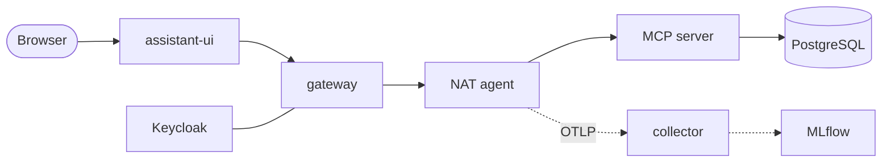

# Lab 01 — Run the agent

## Objective

Get the full stack running, use the agent as a signed-in user, and see for
yourself that the agent itself refuses callers that don't come through the
gateway.

## Concept

A production agent is a distributed system with a probabilistic component in
the middle. The model is one dependency among the nine services `make dev` starts. Most of what you
are about to start exists to authenticate, constrain, observe and measure that
dependency. → [Concept 1](../concepts/01-agents-and-agent-loops.md)

## Architecture before

Nothing is running. You have a clone and Docker.

## Exercise

1. Decide on a model endpoint. The default is a local Ollama serving `qwen3:8b`
   at `http://host.docker.internal:11434/v1`. Any OpenAI-compatible endpoint
   works; see [CONFIGURATION.md — model endpoint](../CONFIGURATION.md#model-endpoint).
   If you use a hosted model, set `LLM_BASE_URL`, `LLM_API_KEY`, `LLM_MODEL` **and
   `LLM_GUARD_MODEL`** in `.env`, because the guard model does not inherit
   `LLM_MODEL`.
2. Start everything.

## Run it

```bash
make env          # create .env from .env.example (only if missing)
make pull-models  # pulls LLM_MODEL / LLM_GUARD_MODEL; no-op unless Ollama
make dev          # build and start the cluster
make wait         # wait for UI, gateway, Keycloak, MLflow, collector
make ps           # what is running
make login-info   # URLs and the development credentials
make open-ui      # http://localhost:3000
```

Sign in with `agent` / `agent`, then try:

```text
Show me the open support tickets
Summarize ticket TKT-1003 and its history
What kinds of support ticket questions can you help me with?
```

## Observe

* The UI redirects you to Keycloak before showing the chat. The browser never
  receives a token, only an opaque session cookie (DevTools → Application →
  Cookies, path `/api/gateway`).
* Tool calls appear as cards (*Calling search_tickets*, *Calling get_ticket*)
  before the answer streams. The capabilities question uses no tool.
* `make ps` lists the services. Only the UI, Keycloak, MLflow and the collector
  publish host ports. The gateway, agent, MCP server and database publish none.
* `make open-mlflow`, then **Default** experiment → **Traces**: one trace per
  prompt.

## Break it

Try to skip the gateway and talk to the agent directly. The agent publishes no
port, so do it from inside the gateway's container, which is on `agent_net`:

```bash
# No service credential
docker compose exec -T gateway sh -lc \
  'curl -s -o /dev/null -w "%{http_code}\n" -X POST -H "content-type: application/json" \
   -d "{\"messages\":[{\"role\":\"user\",\"content\":\"hi\"}]}" http://agent:8000/v1/workflow/full'

# Service credential, but no asserted identity
docker compose exec -T gateway sh -lc \
  'curl -s -w " %{http_code}\n" -X POST -H "Authorization: Bearer $AGENT_API_KEY" \
   -H "content-type: application/json" \
   -d "{\"messages\":[{\"role\":\"user\",\"content\":\"hi\"}]}" http://agent:8000/v1/workflow/full'
```

Observed:

```text
401
{"error":"missing or ambiguous authenticated identity"} 401
```

Then run the full set of boundary assertions:

```bash
make auth-test
make network-test
```

## Why it failed

Two independent checks, in order
([`fastapi_worker.py`](https://github.com/cognokratos/simple-agent-template/blob/main/agent/src/nat_streaming_react/fastapi_worker.py)):
`StaticServiceKeyMiddleware` asks *"are you the gateway?"* and
`RequireIdentityHeaderMiddleware` asks *"who are you acting for?"*. Being on the
right network answers neither. NAT trusts the identity header it receives, so it
must only accept it from a caller that has proved it is the gateway.

## Architecture after



Full version with trust boundaries: [concept 7](../concepts/07-security-and-trust-boundaries.md#diagram-d-trust-boundaries).

## On the Rig implementation

Same commands, same results: `401` with no credential, then
`{"error":"missing or ambiguous authenticated identity"}` with the credential
but no identity, and `make auth-test` / `make network-test` pass unchanged.
The two checks live in the service's own middleware,
[`api/auth.rs`](https://github.com/cognokratos/simple-agent-template/blob/rust-agent/agent/src/api/auth.rs), rather than around a framework. Two things to
notice on `rust-agent`:

* `make version` reports `"agent_runtime": "rig-rust"`, the Rig and rmcp
  versions, and the same `prompt_sha256` as on `main`;
* the agent image is distroless — there is no shell in it — so in-container
  checks use the binary itself, for example
  `docker compose exec agent /usr/local/bin/tickets-agent probe mcp-auth`.

## What you learned

* The model is one dependency. The system around it is ordinary, inspectable
  infrastructure.
* Identity is established by the gateway. The agent requires proof of *who is
  calling* and *for whom*, and network position proves neither.
* Every prompt leaves a trace you can inspect.

## Go deeper

* [README — Quick start](../../README.md#quick-start)
* [ARCHITECTURE.md](../ARCHITECTURE.md), [SECURITY.md](../SECURITY.md)
* [TEST-SCENARIOS.md — authentication](../TEST-SCENARIOS.md#authentication-and-service-boundary-scenarios)
* Next: [Lab 02 — Understand tool calling](02-understand-tool-calling.md)
