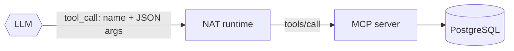
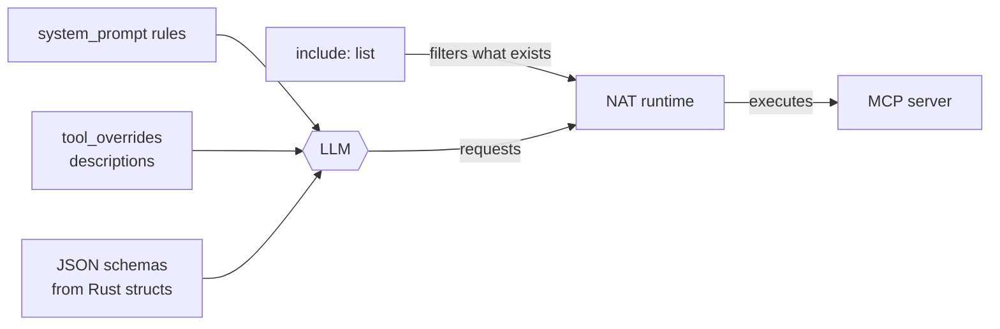

# Lab 02 — Understand tool calling

## Objective

See exactly what the model is given (tool names, descriptions, schemas), how
that steers its choices, and where the line falls between the model *requesting*
a call and the runtime *executing* it.

## Concept

A tool is an externally implemented capability exposed through a typed
interface. The model chooses a tool and arguments based purely on text you
wrote: the description and the schema. Tool descriptions are prompts.
→ [Concept 2](../concepts/02-tools-and-mcp.md)

## Architecture before



## Exercise

1. Read the two tools in [`mcp-server/src/main.rs`](../../mcp-server/src/main.rs):
   the argument structs `SearchTicketsArgs` and `GetTicketArgs` (the doc comments
   become schema descriptions), and the `#[tool(description = ...)]` on each
   function.
2. Read `function_groups.tickets_mcp` in [`agent/config.yml`](../../agent/config.yml).
   Note `include:` (which tools the agent may use at all) and `tool_overrides`
   (the descriptions the model actually sees, which replace the Rust ones).
3. Read the `system_prompt` rules that mention tools. `{tools}` and
   `{tool_names}` are filled in by NAT at startup from MCP discovery.
4. Optionally, look at the raw MCP surface with the loopback-only, token-gated
   MCP Inspector:

```bash
make inspector         # start the optional inspector (dev profile)
make inspector-tools   # tools/list straight from the MCP server, bypassing NAT
make open-inspector    # or browse it
```

## Run it

Run these scenarios from [TEST-SCENARIOS.md](../TEST-SCENARIOS.md#functional-and-mcp-scenarios)
in the UI, and watch the tool cards:

| Prompt | Expected tools |
| --- | --- |
| `Show me my open tickets.` | `search_tickets(status="open")` |
| `Show me the complete details and history for ticket TKT-1001.` | `get_ticket(ticket_id="TKT-1001")` |
| `Show me the complete details for ticket TKT-9999.` | `get_ticket`, which returns a "not found" error |
| `What kinds of support ticket questions can you help me with?` | none |
| `Show the history for all open tickets.` | `search_tickets`, then `get_ticket` × 5 |

## Observe

* Expand a tool card: the **input** is exactly the JSON the model produced, and
  the **output** is exactly what the MCP server returned. The model sees that
  same output on its next turn.
* `TKT-9999`: the tool's `invalid_params` error ("Ticket 'TKT-9999' was not
  found") reaches the model as an observation, because
  `pass_tool_call_errors_to_agent: true`. Observed answer on the default model:
  *"The ticket ID "TKT-9999" could not be found. Please verify the ticket ID
  and try again."*
* The last prompt is the interesting one. Count the `get_ticket` cards. On the
  default model we observed **three** `get_ticket` calls for five open tickets,
  in every run (details in
  [lab 04](04-break-the-agent.md#experiment-2-tool-call-explosion)).

## Break it

Both changes are local edits to `agent/config.yml`, followed by
`make rebuild-agent`. Revert afterwards.

**A. Remove the fan-out instruction.** In `tool_overrides.get_ticket.description`,
delete the sentence *"When the user asks for history across multiple tickets,
call this tool separately once for every ticket ID returned by search_tickets."*
Rebuild and rerun *"Show the history for all open tickets."* several times.
Count `get_ticket` calls and compare with the baseline above.

**B. Remove a capability.** Delete `- get_ticket` from `include:`. Rebuild and
ask for TKT-1001's history. Then:

```bash
make logs-agent
```

At startup NAT logs one line per tool it adds to the group, for example
`nat.plugins.mcp.client.client_impl - Adding tool get_ticket to group`.
Compare those lines before and after the change.

## Why it failed

* **A** shows that descriptions are behavioural configuration. Whatever you
  observed (more calls, fewer, no change), the description is an input to a
  probabilistic decision, and only repeated runs or an evaluation tell you its
  effect. The `tools` suite exists for exactly this (`TOOLS-FANOUT-OPEN-TICKETS`).
* **B** is deterministic: a tool not in `include:` does not exist for the model.
  No prompt can make the runtime call it. Capability is configuration and code,
  not model behaviour. That is the property later labs rely on.

## Architecture after

Unchanged, but you can now name every input to the model's tool decision:



## What you learned

* The model sees names, descriptions and schemas, never your code.
* Tool descriptions steer behaviour as strongly as the system prompt, and need
  evaluating the same way.
* Errors returned as data let the agent explain failure instead of inventing.
* `include:` is a hard capability boundary. Descriptions are soft guidance.

## Go deeper

* [Concept 2 — when agent problems are API-design problems](../concepts/02-tools-and-mcp.md#when-agent-problems-are-api-design-problems)
* [EVALUATION.md — suites](../EVALUATION.md#suites),
  [`evaluation/datasets/tool_calling.json`](../../evaluation/datasets/tool_calling.json)
* Next: [Lab 03 — Add an MCP tool](03-add-an-mcp-tool.md)
