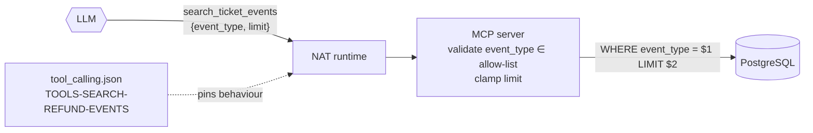

# Lab 03 — Add an MCP tool

## Objective

Add a new read-only capability end to end: a typed Rust MCP tool with
parameterized SQL, exposed to the agent, exercised from the UI, visible in the
trace, and pinned by an evaluation case.

## Concept

Adding a tool is a **capability change**. It widens what the model can cause.
It needs the same review as a new API endpoint: typed input, validation, bounded
output, least privilege, and a test. Here the "test" is an evaluation case,
because the caller is probabilistic. → [Concept 2](../concepts/02-tools-and-mcp.md)

## Architecture before

The agent has two tools, `search_tickets` and `get_ticket`. To answer *"which
tickets have had refund updates?"* it must fetch every ticket's full history
and filter in its head. That is the fan-out pattern from lab 02.

## Exercise

You will add `search_ticket_events(event_type, limit?)`: history events of one
type across all tickets, newest first.

### 1. The input schema

In [`mcp-server/src/main.rs`](../../mcp-server/src/main.rs), next to the other
argument structs:

```rust
#[derive(Debug, Deserialize, JsonSchema)]
struct SearchTicketEventsArgs {
    /// Event type: one of "customer_message", "support_note",
    /// "shipping_update", "refund_update" or "status_change".
    event_type: String,
    /// Maximum number of events to return. Defaults to 20 and is capped at 100.
    limit: Option<i64>,
}
```

The doc comments become the JSON Schema descriptions the model reads.

### 2. The tool

Inside the `#[tool_router] impl TicketsMcpServer` block, after `get_ticket`:

```rust
    #[tool(
        description = "List history events of one type across all tickets, newest first. Use for questions such as 'which tickets have had refund updates?'. Returns ticket IDs; call get_ticket for a ticket's full details."
    )]
    async fn search_ticket_events(
        &self,
        Parameters(args): Parameters<SearchTicketEventsArgs>,
    ) -> Result<CallToolResult, McpError> {
        const EVENT_TYPES: &[&str] = &[
            "customer_message",
            "support_note",
            "shipping_update",
            "refund_update",
            "status_change",
        ];
        let event_type = args.event_type.trim();
        if !EVENT_TYPES.contains(&event_type) {
            return Err(McpError::invalid_params(
                format!("event_type must be one of: {}", EVENT_TYPES.join(", ")),
                None,
            ));
        }
        let limit = args.limit.unwrap_or(20).clamp(1, 100);

        let events = sqlx::query_as::<_, TicketEvent>(
            r#"
            SELECT id, ticket_id, occurred_at, event_type, author, summary
            FROM ticket_events
            WHERE event_type = $1
            ORDER BY occurred_at DESC
            LIMIT $2
            "#,
        )
        .bind(event_type)
        .bind(limit)
        .fetch_all(&self.pool)
        .await
        .map_err(Self::database_error)?;

        let response = json!({
            "count": events.len(),
            "filters": { "event_type": event_type, "limit": limit },
            "events": events,
        });
        Ok(CallToolResult::success(vec![ContentBlock::text(
            response.to_string(),
        )]))
    }
```

Note what the model *cannot* influence: the operation (a `SELECT` on one
table), the columns, the ordering, the maximum size, and the set of valid event
types. It chooses only `event_type` and `limit`, and both are validated.

### 3. Check it compiles

```bash
cd mcp-server && cargo clippy --all-targets -- -D warnings && cargo test
```

### 4. Expose it to the agent

In [`agent/config.yml`](../../agent/config.yml), add it to the allow-list. A
tool the MCP server offers is invisible to the agent until it is listed:

```yaml
    include:
      - search_tickets
      - get_ticket
      - search_ticket_events
```

Optionally add a `tool_overrides` entry with a sharper description, and a
`system_prompt` rule ("For questions about one kind of event across tickets,
call search_ticket_events").

### 5. Teach the evaluator the tool's name

The harness only counts recognised tool names as tool calls. In `.env`:

```bash
EVALUATION_TOOL_NAMES=search_tickets,get_ticket,search_ticket_events
```

### 6. Add an evaluation case

Append to [`evaluation/datasets/tool_calling.json`](../../evaluation/datasets/tool_calling.json):

```json
{
  "inputs": {
    "question": "Which tickets have had refund updates?",
    "case_id": "TOOLS-SEARCH-REFUND-EVENTS"
  },
  "expectations": {
    "expected_tool_calls": [
      { "name": "search_ticket_events", "arguments": { "event_type": "refund_update" } }
    ],
    "order_mode": "exact",
    "arguments_match": "subset",
    "allow_unexpected_tools": false
  },
  "tags": { "category": "single_tool_event_search", "priority": "high" }
}
```

## Run it

```bash
make rebuild-mcp      # builds the MCP server; recreates MCP, agent, gateway, UI
make rebuild-agent    # bakes the edited config.yml into the agent image
make wait
make logs-agent       # look for: Adding tool search_ticket_events to group
```

In the UI: *"Which tickets have had refund updates?"*

Then pin the behaviour:

```bash
make eval-bootstrap SUITE=tools
make eval-tools
```

## Observe

* A tool card for `search_ticket_events` with `{"event_type": "refund_update"}`.
* The answer names the tickets whose history has `refund_update` events in
  [`db/init.sql`](../../db/init.sql) (`TKT-1004` and `TKT-1005`).
* The trace (lab 06) contains a `tickets_mcp__search_ticket_events` span under
  `<workflow>`.
* `evaluation/results/tools-latest.json` contains your case. If the model chose
  a different trajectory, the rationale shows the expected and actual calls.

## Break it

**A. Forget the allow-list.** Remove `search_ticket_events` from `include:` and
rebuild the agent. The MCP server still offers it (`make inspector-tools`), but
the agent never sees it. Capability is two-sided: the server implements it and
the agent's configuration grants it.

**A′. The other direction.** Keep `search_ticket_events` in `include:` but run an
MCP server *without* the tool (for example, revert `main.rs` and run
`make rebuild-mcp` before rebuilding the agent). The agent refuses to start and
keeps restarting. `make logs-agent` shows:

```text
ERROR - nat.builder.workflow_builder - Failed to initialize component tickets_mcp (function_groups)
ERROR - nat.builder.workflow_builder - Original error: Unknown included functions: ['search_ticket_events']
```

That happened while this lab was being written. It is the right behaviour: a
granted capability that doesn't exist is a deployment error, so the agent fails
closed at startup instead of running with a different tool surface than
configured. When you revert a tool, revert the agent config first.

**B. Read, don't run, the insecure version.** This is what *not* to write:

```diff
-        let events = sqlx::query_as::<_, TicketEvent>(
-            r#"... WHERE event_type = $1 ... LIMIT $2"#,
-        )
-        .bind(event_type)
-        .bind(limit)
+        // DO NOT DO THIS
+        let sql = format!(
+            "SELECT ... FROM ticket_events WHERE event_type = '{}' LIMIT {}",
+            args.event_type, limit
+        );
+        let events = sqlx::query_as::<_, TicketEvent>(&sql)
```

## Why it failed

The format-string version turns the model's argument into SQL. The model's
arguments are influenced by user text *and* by any text it read from earlier
tool results. A ticket description containing `x' OR '1'='1` is now an attack
on your database, delivered by your own agent. Parameter binding makes the
argument a value, whatever its content. The allow-list of event types adds a
second, domain-level check.

## Architecture after



One model round trip now answers what used to need a fan-out.

## On the Rig implementation

The MCP side of this lab is identical. On the agent side, add
`search_ticket_events` to `tools.mcp.include` (and, if you want, a description
under `tools.mcp.overrides`), then `make rebuild-agent`. Differences to observe:

* the startup log lists the new tool in `discovered MCP tools`;
* in the trace, the tool span `tickets_mcp__search_ticket_events` sits under
  Rig's `execute_tool` span, beside a `tool.policy` span;
* **Break it A′** fails closed the same way, with
  `tool "search_ticket_events" is in tools.mcp.include but the MCP server does not offer it`;
* the Rig agent also refuses to start if the new tool's schema uses a JSON
  Schema keyword it does not enforce, or declares an argument such as
  `user_id` — try adding `requester: String` and then `user_id: String` to
  `SearchTicketEventsArgs` and compare.

## What you learned

* A tool has three owners: the server implements it, the agent config grants
  it, and the evaluation set pins how it is used.
* Validate model-supplied arguments like any untrusted input. Bind, don't
  interpolate.
* Better tool granularity is often the cheapest fix for agent reliability and
  latency.

## Go deeper

* [EXTENDING.md](../EXTENDING.md#recommended-sequence)
* [EVALUATION.md — adding a case](../EVALUATION.md#adding-a-case),
  [EVALUATION.md — generalizing](../EVALUATION.md#generalizing-for-a-domain-application)
* Challenge: [Beginner — a new read-only tool](../CHALLENGES.md#beginner-a-new-read-only-tool)
* Next: [Lab 04 — Break the agent](04-break-the-agent.md)
