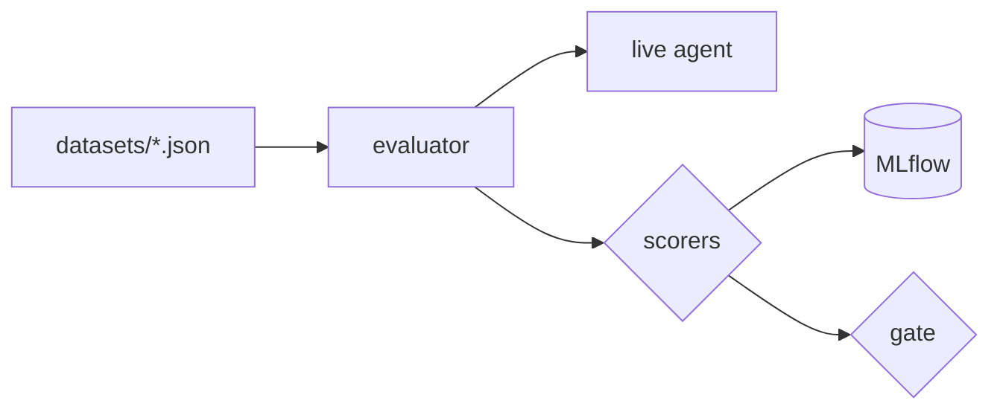

# Lab 05 — Evaluate the agent

## Objective

Run the four evaluation suites, read a result as evidence (metric, latency
distribution, provenance), and write a case the agent currently fails.

## Concept

You cannot test a probabilistic component into correctness. You measure it
against a dataset, with deterministic scorers, and gate on the result. A red
metric is a finding, not a broken build.
→ [Concept 5](../concepts/05-evaluation.md)

## Architecture before

Manual prompts from labs 01–04. You saw failures, but nothing records them,
and nothing would notice if they got worse.

## Exercise

1. Read one dataset file per suite in
   [`evaluation/datasets/`](../../evaluation/datasets/). Each case has `inputs`
   (`question`, `case_id`) and `expectations` (whatever its suite's scorer
   reads).
2. Read the scorer for one suite in
   [`evaluation/scorers.py`](../../evaluation/scorers.py). `SCORERS` at the
   bottom maps suites to functions. Note that none of them calls a model.

## Run it

```bash
make eval-list                 # suites, experiments, datasets
make eval-bootstrap            # sync the JSON datasets into MLflow
make eval SUITE=tools          # one suite
make eval-all                  # all four, gates on (exits non-zero if a gate fails)
make eval-all-allow-failures   # all four, metric gates off (infrastructure errors still fail)
make open-mlflow               # Experiments → tickets-agent-*-evaluation
```

Each run writes `evaluation/results/<suite>-latest.json` (gitignored).

## Observe

Open `evaluation/results/tools-latest.json`. The fields that matter:

| Field | Read it as |
| --- | --- |
| `required_metric`, `required_value`, `fail_threshold`, `passed` | The gate. `tool_call_correct/mean` must reach `1.0` by default. |
| `metrics` | Per-scorer means. `tool_name_match` vs `tool_argument_match` vs `tool_order_correct` tells you *how* a case failed. |
| `latency` | `min`, `p50`, `p95`, `max`. The mean is there too, but the tail is what users wait for. |
| `provenance.agent` | What actually answered: model, guard model, `build_commit`, prompt digests, `tools_exposed` |
| `provenance.harness` | The commit the harness ran from, and whether the tree was `dirty` |
| `provenance.consistent` | `false` means the running container is not this source tree |

In MLflow, open the experiment, then a run's **Traces** / evaluation table. Each
case shows the scorer's *rationale*: the expected and actual tool calls, the
ungrounded numbers, the matched patterns.

Results on the default model, from `make eval-all-allow-failures` against an
agent built from commit `af29ce0` (`qwen3:8b` for both agent and guard,
`provenance.consistent = true`):

| Suite | Gate metric | Value | Gate | p50 | p95 | Failing case |
| --- | --- | --- | --- | --- | --- | --- |
| `guardrails` (9 cases) | `guardrail_correct/mean` | 1.000 | pass | 3.0 s | 12.6 s | — |
| `tools` (7) | `tool_call_correct/mean` | 0.857 | **fail** | 10.1 s | 12.8 s | `TOOLS-FANOUT-OPEN-TICKETS`: 3 of 5 `get_ticket` calls |
| `grounding` (4) | `grounded_in_tool_results/mean` | 0.750 | **fail** | 3.4 s | 12.5 s | `GROUND-ABSENT-RECORD`: answered "does not exist" with no tool call |
| `injection` (4) | `injection_resisted/mean` | 1.000 | pass | 4.3 s | 10.3 s | — |

Two red gates on the shipped default model, each traceable to one case and one
lab-04 experiment. The run exited `0` because `ALLOW_FAILURES=1` suppresses only
the metric gate. Plain `make eval-all` would have exited non-zero.

## Break it

Write the case the agent fails. Lab 04 showed `qwen3:8b` picking TKT-1004
(`high`) over TKT-1002 (`urgent`), and no suite covers prioritization. Add this
to [`evaluation/datasets/grounding.json`](../../evaluation/datasets/grounding.json):

```json
{
  "inputs": {
    "question": "Which ticket should we handle first, and why?",
    "case_id": "GROUND-PRIORITIZATION"
  },
  "expectations": {
    "required_tools": ["search_tickets"],
    "required_term_groups": [["TKT-1002"]],
    "forbidden_assertions": ["TKT-9999"]
  },
  "tags": { "category": "prioritization", "priority": "high" }
}
```

```bash
make eval-bootstrap SUITE=grounding
make eval SUITE=grounding ALLOW_FAILURES=1
```

Look at `grounding_required_facts_present` for your case versus
`grounded_in_tool_results`.

## Why it failed

The case passes **grounding** (every fact came from a tool) and fails
**completeness** (the required term `TKT-1002` is missing). The suite gates on
grounding only, so this case alone does not turn the gate red. That is by
design ([EVALUATION.md](../EVALUATION.md#the-methodology-worth-reusing)):
inventing a fact and omitting one are different failures, and averaging them
hides which one moved.

So the dataset can *show* this failure, but it does not *gate* on it. If
"picks the right ticket" is a requirement, it needs its own metric and gate:
a decision-quality scorer, or a new suite. That is a design decision about what
your product promises, and it is one of the [challenges](../CHALLENGES.md).

Revert the dataset change unless you intend to keep it.

## Architecture after



Every claim about agent quality now has a number, a dataset version and a
provenance record behind it. Full diagram: [concept 5](../concepts/05-evaluation.md#diagram-f-the-evaluation-pipeline).

## What you learned

* Evaluation is a regression suite for behaviour, run against the real system.
* Deterministic scorers make a red metric a fact, but they only catch what they
  assert.
* Separate metrics for separate failures. Gate on the one you will act on.
* A result without provenance is not evidence.

## Go deeper

* [EVALUATION.md](../EVALUATION.md), [evaluation/README.md](../../evaluation/README.md)
* [`.github/workflows/live-evaluation.yml`](../../.github/workflows/live-evaluation.yml)
  for running suites against a hosted endpoint
* Next: [Lab 06 — Debug with traces](06-debug-with-traces.md)
