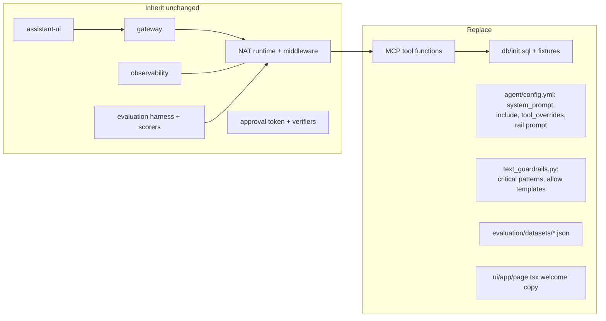

# Lab 10 — Build your own domain agent

## Objective

Replace the support-ticket sample with your own domain while inheriting the
authentication, isolation, guardrails, observability, evaluation and approval
infrastructure unchanged.

## Concept

Almost everything in this repository is domain-independent infrastructure
around a probabilistic component. The domain is a small, well-defined set of
files. Knowing exactly which ones is what makes the template reusable.
→ [Learning path, stage 10](../LEARNING-PATH.md#stage-10-production-agent-architecture)

## Architecture before



The authoritative list is in [EXTENDING.md](../EXTENDING.md#what-is-the-sample).

## Exercise

Pick a domain with structured, authoritative state and questions that need
interpretation. Examples: library loans, IT asset inventory, clinical trial
site status (synthetic data only), internal incident tracker.

Follow [EXTENDING.md's recommended sequence](../EXTENDING.md#recommended-sequence),
and gate each step before moving on:

| Step | Do | Gate before moving on |
| --- | --- | --- |
| 1. Fork and isolate | Set `COMPOSE_PROJECT_NAME` so your stack and this one keep separate volumes ([CONFIGURATION.md](../CONFIGURATION.md#project-and-volume-identity)) | `make static-check` |
| 2. Schema | Replace `db/init.sql`. Add `CHECK` constraints for every enumerated field. Keep the approval tables if you might need them later. | `make dev` starts; `make shell-db` shows your data |
| 3. Tools | Replace the tool functions in `mcp-server/src/main.rs`. **Read-only first.** Typed args, validated, bound, clamped (lab 03). | `cd mcp-server && cargo clippy --all-targets -- -D warnings && cargo test`; `make inspector-tools` |
| 4. Agent config | Rewrite `system_prompt` (keep `{tools}` / `{tool_names}`), `include:`, `tool_overrides` | Tool cards appear for your prompts in the UI |
| 5. Input policy | Rewrite the `self_check_input` prompt, `_CRITICAL_INPUT_PATTERNS` and `_READ_ONLY_TICKET_TEMPLATES` for your domain. Anchor allow templates to the complete message. | `make verify-input-guardrails`; your common queries are not blocked |
| 6. Output policy | Review the regex patterns and the Presidio entity list. Which entities are *needed* in answers (as names are here)? | `make verify-output-guardrails` |
| 7. Injection fixtures | Seed dedicated, never-mutated records whose free text carries injection payloads (copy the shape of `db/injection_test_fixtures.sql`) | — |
| 8. Evaluation | New datasets for all four suites; set `EVALUATION_TOOL_NAMES` and the experiment names | `make eval-all` passes on your chosen model |
| 9. Traces | Check what your tool spans record. Real data will be sensitive. | `make trace-test` |
| 10. Mutations (only if needed) | Add an approval-gated action ([lab 08](08-add-a-state-changing-action.md), [EXTENDING.md](../EXTENDING.md#adding-an-approval-gated-action)) | `make verify-approvals-rust`; `make verify-approvals` |

## Run it

```bash
make static-check
make dev && make wait
make test
make eval-all
```

## Observe

Track how much you changed outside the "Replace" box. If you had to edit the
gateway, NAT middleware, the observability package or the scorers, write down
why. That is either a genuine gap in the template (worth an issue upstream) or a
sign that domain logic is leaking into infrastructure.

## Break it

Before step 5, run your domain's most common questions through the *unchanged*
ticket-specific input rail and look at `guardrail.decision_source` in the
traces. Expect some false positives: the self-check prompt and allow templates
describe ticket lookups, not your domain. That is why step 5 exists.

## Why it failed

Guardrail policy is a **domain judgement**. What counts as a harmful request, and
which routine requests a classifier tends to over-block, differs per domain. The
mechanism (layering, precedence, anchoring, decision recording) is reusable. The
policy is not.

## Architecture after

The same architecture with your domain in the "Replace" box, the same
deterministic boundaries, and evaluation numbers for *your* agent on *your*
model.

## What you learned

* The domain surface is schema, tools, prompts, input policy, fixtures and
  datasets.
* Start read-only. Add mutation only through the approval boundary.
* Every domain needs its own evaluation datasets and injection fixtures before
  it needs a bigger model.

## Go deeper

* [EXTENDING.md](../EXTENDING.md), [LIMITATIONS.md — before production](../LIMITATIONS.md#before-production)
* Challenge: [Expert — replace the domain](../CHALLENGES.md#expert-replace-the-domain)
