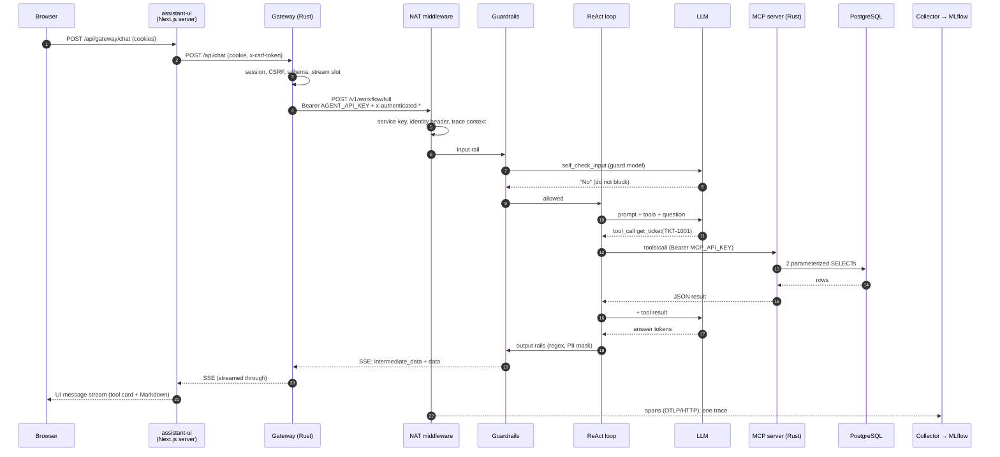

# Follow one request

> *"Show me the complete details and history for ticket TKT-1001."*

This walkthrough traces that prompt from the browser to PostgreSQL and back,
through the actual code, and ends at the trace it leaves in MLflow. Read it with
the source open: code → explanation → runtime behaviour → trace.

Steps 1–17 follow the canonical NAT agent. Steps 1–4 and 9–12 — the browser, UI,
gateway, MCP server and database — are the same code for the Rig agent on
`rust-agent`; [the same request on the Rig implementation](#the-same-request-on-the-rig-implementation)
retraces steps 5–8 and 13–17 there, with its own measured trace.

Every timing and span name below comes from real runs against this repository
on the default configuration (`qwen3:8b` on a local Ollama, guard model the
same): a *cold* run, the first request the guard model served, and a *warm*
repeat on an agent built from commit `af29ce0`. Your numbers will differ. The
shape should not.

## The whole path



---

## 1. The browser sends the message

The page is a client component built on assistant-ui.
[`ui/app/page.tsx`](../../ui/app/page.tsx) wires the chat runtime to a
*same-origin* route:

```tsx
() => new AssistantChatTransport({ api: "/api/gateway/chat" }),
```

The browser holds **no tokens**: no OIDC token, no API key, nothing the model
could leak. It holds an opaque, `HttpOnly` session cookie and a CSRF cookie,
both scoped to `Path=/api/gateway` ([SECURITY.md — cookies](../SECURITY.md#cookies)).

## 2. The UI server proxies to the gateway

[`ui/app/api/gateway/chat/route.ts`](../../ui/app/api/gateway/chat/route.ts)
(`POST`) runs on the Next.js server. It flattens the UI messages to
`{role, content}` text and makes a server-side `fetch` to the gateway's
`/api/chat`. It forwards the cookie header and copies the CSRF cookie into
`x-csrf-token`.

The UI is a proxy, **not a trust boundary**
([ARCHITECTURE.md](../ARCHITECTURE.md#what-each-boundary-is-for)). Everything
that matters is checked again by the gateway.

## 3. The gateway authenticates the session

`proxy::chat` in [`gateway/src/proxy.rs`](../../gateway/src/proxy.rs):

```rust
let (_session_id, session) = authenticated_session(&state, &headers).await?;
verify_csrf(&state.config, &headers, &session)?;
```

`authenticated_session` ([`auth.rs`](../../gateway/src/auth.rs)) looks up the
opaque session id, rejects expired sessions, and refreshes Keycloak tokens
(re-reading roles from `userinfo`) when the 5-minute access token is near
expiry. `verify_csrf` ([`session.rs`](../../gateway/src/session.rs)) requires the
cookie, the header and the session's own token to agree.

**Concept:** authentication is established once, by a deterministic component,
before any model is involved. → [Concept 7](../concepts/07-security-and-trust-boundaries.md)

## 4. The gateway validates, sanitises and mints identity

Still in `proxy::chat`:

1. **Schema.** The body is parsed into `ChatProxyRequest` with
   `deny_unknown_fields`. `validate_chat_request` accepts only `user` and
   `assistant` roles, requires the last message to be `user`, and bounds count,
   per-message characters and total characters.
2. **Concurrency.** A per-session stream slot (`GATEWAY_MAX_STREAMS_PER_SESSION`,
   default 4).
3. **Re-serialisation.** Anything beyond the schema does not survive.
4. **A fresh upstream request** with `Authorization: Bearer <AGENT_API_KEY>`, a
   new `x-request-id`, and identity headers built from the *session*:

```rust
let request = identity_headers(request, &session.user, true)?;
```

`identity_headers` sets `x-authenticated-user-id`, `-username`, `-roles` and
`-email`. No browser header is forwarded, so neither the page nor the model can
choose who the agent thinks the user is.

The URL is `AGENT_WORKFLOW_URL` (`http://agent:8000/v1/workflow/full`) with
`filter_steps=TOOL_START,TOOL_END,FUNCTION_START,FUNCTION_END`, so the stream
carries tool events the UI can render.

## 5. The agent authenticates its caller

NAT's FastAPI app is built by `AuthenticatedFastApiFrontEndPluginWorker` in
[`agent/src/nat_streaming_react/fastapi_worker.py`](https://github.com/cognokratos/simple-agent-template/blob/main/agent/src/nat_streaming_react/fastapi_worker.py),
selected by `general.front_end.runner_class` in
[`agent/config.yml`](../../agent/config.yml). Its pure-ASGI middleware runs
outermost first:

| Middleware | Does |
| --- | --- |
| `StaticServiceKeyMiddleware` | `hmac.compare_digest` on the bearer token; **removes** `Authorization` from the request before NAT, session metadata or telemetry can see it |
| `RequireIdentityHeaderMiddleware` | Exactly one non-empty `x-authenticated-user-id`, or 401 |
| `WorkflowTraceContextMiddleware` | Creates the trace id and root span id for this request ([`trace_context.py`](https://github.com/cognokratos/simple-agent-template/blob/main/agent/src/nat_streaming_react/observability/trace_context.py)) |
| `ResponderIdentityMiddleware` | Records the caller for the approval feature's ownership check |

NAT then resolves `x-authenticated-user-id` into `Context.user_id`
(`identity_header` in config).

## 6. Input guardrails run

The workflow is wrapped by the `text_guardrails` middleware
(`workflow.middleware: [workflow_guardrails]`). `TextGuardrailsMiddleware.pre_invoke`
in [`text_guardrails.py`](https://github.com/cognokratos/simple-agent-template/blob/main/agent/src/nat_streaming_react/text_guardrails.py):

1. extracts the latest user turn and records it as the trace's readable question;
2. refuses (does not truncate) anything over `GUARDRAILS_INPUT_MAX_CHARS`;
3. runs the NeMo `self check input` flow, which is a call to the **guard model**
   with the `self_check_input` prompt from `agent/config.yml`;
4. runs `_CRITICAL_INPUT_PATTERNS` over the latest turn and any client-supplied
   assistant turns, and the anchored `_READ_ONLY_TICKET_TEMPLATES`;
5. resolves the decision with `_resolve_input_policy`.

For this prompt the guard model allowed it, and the `specific_ticket_details`
allow template also matched. The span recorded
`guardrail.decision_source = llm_and_deterministic_allow`. This step took
**2.79 s** cold and **0.24 s** warm, almost all of it the guard-model call.

**Concept:** a probabilistic check backed by deterministic ones, with the
decision source recorded. → [Concept 4](../concepts/04-guardrails-and-deterministic-controls.md)

## 7. The agent runtime invokes the LLM

`streaming_react_agent_workflow` in
[`register.py`](https://github.com/cognokratos/simple-agent-template/blob/main/agent/src/nat_streaming_react/register.py) builds NAT's
ReAct graph with the `primary` LLM, the `tickets_mcp` tools and the
`system_prompt` (whose `{tools}` and `{tool_names}` placeholders NAT fills from
MCP discovery). Because `use_native_tool_calling: true`, the tool schemas go to
the model as structured definitions.

The loop is bounded: `recursion_limit = (max_tool_calls + 1) * 2`.

## 8. The model chooses a tool

The model returns a structured tool call, not prose:

```text
get_ticket  {"ticket_id": "TKT-1001"}
```

It chose this from the tool description (from `tool_overrides` in
`agent/config.yml`) and the system-prompt rule *"For details about a specific
ticket, call get_ticket using its exact ID."* This is the probabilistic decision
in the request. Everything after it is deterministic again until the answer is
written.

## 9. The MCP request is issued

NAT's `mcp_client` function group `tickets_mcp` sends `tools/call` over
streamable HTTP to `http://mcp-server:8080/mcp`, with
`Authorization: Bearer ${MCP_API_KEY}` (`custom_headers` in config) and a
30-second `tool_call_timeout`. In the stream, this appears as:

```text
intermediate_data: {"type":"FUNCTION_START","name":"tickets_mcp__get_ticket", ... "input":{"ticket_id":"TKT-1001"} ...}
```

## 10. The Rust MCP server validates and executes

[`mcp-server/src/main.rs`](../../mcp-server/src/main.rs):

* `require_api_key` compares the bearer token in constant time and **removes** it
  before RMCP logging;
* RMCP deserialises arguments into `GetTicketArgs { ticket_id: String }`, a typed
  schema;
* `get_ticket` trims and rejects an empty id, then runs two parameterized
  queries: the ticket by `id = $1`, and its `ticket_events` by
  `ticket_id = $1 ORDER BY occurred_at DESC`.

## 11. PostgreSQL provides authoritative data

The rows come from [`db/init.sql`](../../db/init.sql): `TKT-1001`, "Delayed
delivery", `open`, `medium`, customer Renee Castillo, assigned to Priya Shah,
with three history events `EVT-1001`–`EVT-1003`. `CHECK` constraints guarantee
`status` and `priority` are valid values. PostgreSQL is reachable from the MCP
server and nothing else (`data_net`).

## 12. The tool result returns to the agent

`get_ticket` returns one text content block containing JSON:

```json
{"ticket": {"id": "TKT-1001", "subject": "Delayed delivery", "status": "open", "priority": "medium", ...},
 "history_count": 3,
 "history": [{"id": "EVT-1003", "event_type": "support_note", ...}, ...]}
```

The tool call took **0.03 s** cold and under 0.01 s warm. From here the result is part of the conversation,
and every string in it is **untrusted data**: a description or support note
could contain instructions. → [Lab 04](04-break-the-agent.md#experiment-1-indirect-prompt-injection)

## 13. The LLM writes the final answer

The ReAct loop sends the conversation plus the tool result back to the model,
which writes the answer. `_stream_fn` in `register.py` yields text chunks as they
arrive, skipping tool-call chunks. Native tool calling has no `Final Answer:`
marker to wait for, and this is why the module exists.

## 14. Output guardrails run

`TextGuardrailsMiddleware` sits between `_stream_fn` and the client. With PII
masking configured (it is, by default), `_stream_with_buffered_masking` buffers
the whole answer, then runs `regex check output` (credential and prompt-leakage
patterns) and `mask sensitive data on output` (Presidio) over it once, and only
then releases it. The released text is what gets recorded as the trace's answer.
Observed: **0.04–0.05 s**, outcome `passed`. Names stay visible on purpose: `PERSON`
and `ORGANIZATION` are not in the entity list.

## 15. The result streams back

The agent's response is server-sent events. Abridged from the real stream:

```text
intermediate_data: {"type":"WORKFLOW_START","name":"support-tickets-agent.invoke", ...}
intermediate_data: {"type":"FUNCTION_START","name":"guardrail_input_self_check_decision", ...}
intermediate_data: {"type":"FUNCTION_START","name":"tickets_mcp__get_ticket", ...}
intermediate_data: {"type":"FUNCTION_END","name":"tickets_mcp__get_ticket", ...}
data: {"value": "The complete details and history for ticket **TKT-1001** are as follows: ..."}
intermediate_data: {"type":"FUNCTION_START","name":"guardrail_output_regex_presidio_decision", ...}
intermediate_data: {"type":"WORKFLOW_END","name":"support-tickets-agent.invoke", ...}
```

The gateway streams it through without buffering (`x-accel-buffering: no`, no
request timeout on this route). The UI route parses `intermediate_data:` into
tool cards (`tool-input-available` / `tool-output-available`) and `data:` into
answer text, using the wire helpers in [`ui/lib/nat-wire.ts`](../../ui/lib/nat-wire.ts).
The page renders Markdown with `react-markdown` **without** raw HTML, so a model
answer cannot inject raw HTML.

## 16. OpenTelemetry records the execution

NAT's spans pass through three processors registered in
[`otlp_exporter.py`](https://github.com/cognokratos/simple-agent-template/blob/main/agent/src/nat_streaming_react/observability/otlp_exporter.py):
`WorkflowContentProcessor` (readable question and answer),
`SensitiveHeaderRedactionProcessor` (credential headers) and
`UserIdentityProcessor` (drops the user id unless `OTEL_TRACE_USER_ID=true`).
Then they go to the collector over OTLP/HTTP. Guardrails spans go through the process-wide OTel
SDK with the same trace id. The collector
([`observability/otel-collector.yml`](../../observability/otel-collector.yml))
batches and forwards to MLflow's `/v1/traces`, experiment `0` (Default).

## 17. MLflow lets you inspect it

The trace recorded for the cold run:

```text
support-tickets-agent.invoke                        17.6 s
  <workflow>                                        17.6 s
    guardrail_input_self_check_decision
    tickets_mcp__get_ticket                         0.03 s
    guardrail_output_regex_presidio_decision
  guardrail.input.self_check     outcome=passed     2.79 s
    guardrails.request → rail → action
      self_check_input qwen3:8b                     2.78 s
  guardrail.output.regex_presidio  outcome=passed   0.05 s
```

Request preview: the question. Response preview: the released answer. The
latency budget, from both runs:

| | Cold | Warm (`af29ce0`) |
| --- | --- | --- |
| Total (`support-tickets-agent.invoke`) | 17.6 s | 12.8 s |
| Input rail (guard-model call) | 2.79 s | 0.24 s |
| `get_ticket` (MCP + PostgreSQL) | 0.03 s | < 0.01 s |
| Output rails | 0.05 s | 0.04 s |
| Remainder: the agent model | ~14.7 s | ~12.5 s |

The remainder is at least two agent-model calls: one to choose the tool, one to
write the answer. The agent model's calls did not appear as separately named
spans in these traces. Their time shows only inside `<workflow>`. In these runs,
agent latency was model latency.

Open it yourself: `make open-mlflow` → **Experiments → Default → Traces**. See
[lab 06](06-debug-with-traces.md).

---

## The same request on the Rig implementation

Same prompt, same model (`qwen3:8b`, local Ollama), the Rig + Rust agent on
`rust-agent`. Steps 1–4 and 9–12 are unchanged; this is what replaces the rest.

**5′. The agent authenticates its caller.** An Axum router
([`api/mod.rs`](https://github.com/cognokratos/simple-agent-template/blob/rust-agent/agent/src/api/mod.rs)) with one middleware,
[`require_gateway`](https://github.com/cognokratos/simple-agent-template/blob/rust-agent/agent/src/api/auth.rs): the service key (constant time, then
removed), exactly one identity header, at most one `x-request-id`. Only then is
a [`TrustedCaller`](https://github.com/cognokratos/simple-agent-template/blob/rust-agent/agent/src/identity.rs) built — a type with no public constructor.
The workflow handler ([`api/workflow.rs`](https://github.com/cognokratos/simple-agent-template/blob/rust-agent/agent/src/api/workflow.rs)) validates the
body, keeps the last 20 messages, opens the root span and spawns the run; the
response is a stream over a channel the run writes into.

**6′. Input guardrails run.** [`input_rail.rs`](https://github.com/cognokratos/simple-agent-template/blob/rust-agent/agent/src/agent/input_rail.rs) applies
the same length bound, deny patterns and allow templates as pure functions, then
one classifier call with the same prompt. Here the classifier said `No` and
`specific_ticket_details` matched: `decision_source = llm_and_deterministic_allow`,
**2.31 s**.

**7′. The agent runtime invokes the LLM.** [`builder.rs`](https://github.com/cognokratos/simple-agent-template/blob/rust-agent/agent/src/agent/builder.rs)
builds a Rig agent for this request — model, system prompt with `{tools}`
filled at startup, one tool per allow-listed MCP tool, each closing over this
request's scope — and [`execution.rs`](https://github.com/cognokratos/simple-agent-template/blob/rust-agent/agent/src/agent/execution.rs) runs it with a
model-call budget and the tool-policy hook.

**8′. The model chooses a tool, software decides.** The model returns
`get_ticket {"ticket_id": "TKT-1001"}` (**2.71 s**). Before Rig runs it, it
calls `ToolPolicyHook::on_dispatch` ([`hooks.rs`](https://github.com/cognokratos/simple-agent-template/blob/rust-agent/agent/src/agent/hooks.rs)), which
checks the tool budget and asks [`ToolPolicy::decide`](https://github.com/cognokratos/simple-agent-template/blob/rust-agent/agent/src/guardrails/tools.rs):
known tool, JSON object, only declared fields of the declared types, read-only —
`Allow`, in under a millisecond. The executor ([`mcp/tools.rs`](https://github.com/cognokratos/simple-agent-template/blob/rust-agent/agent/src/mcp/tools.rs))
re-checks and calls MCP through `rig-rmcp`; the call took **0.045 s**. The
`TOOL_END` event and the span carry a redacted display copy of the result; the
model gets the raw one.

**13′–14′. The answer streams through the output policy.** Only text fragments
from Rig's stream are candidates for the client. Each passes the
[`StreamingOutputGuard`](https://github.com/cognokratos/simple-agent-template/blob/rust-agent/agent/src/guardrails/output.rs): text is released once 320
more characters have arrived behind it, the held text plus 512 characters of
look-behind are scanned for secrets, and PII is masked before release. Outcome
`passed`. The answer turn took **10.53 s**, and the client saw 308 fragments
as they were released — not one buffered block.

**15′. The result streams back** in the same SSE vocabulary — the UI and the
gateway cannot tell the agents apart — with `agent_runtime: "rig-rust"` in the
workflow metadata and `guardrail_output_regex_pii_decision` as the output event.

**16′–17′. One trace.** Every span was created while the root was current, so
Rig's own `chat` and `execute_tool` spans join it with no workaround:

```text
support-tickets-agent.invoke                        15.59 s
  guardrail.input.self_check   llm_and_deterministic_allow   2.31 s
    guard_model.call → chat  qwen3:8b                2.31 s
  chat  qwen3:8b             (chooses get_ticket)    2.71 s
  execute_tool                                       0.05 s
    tool.policy              allow                  <0.01 s
    tickets_mcp__get_ticket  ok                      0.05 s
  chat  qwen3:8b             (writes the answer)    10.53 s
  guardrail.output.stream    passed                 13.26 s  (overlaps the answer)
```

Unlike the NAT trace above, the agent model's calls are their own spans, so the
split is read directly: 15.55 s of 15.6 s was model time. The deterministic
column of the table below is the same for both runtimes; on Rig it gains one
row, *8b tool policy — deterministic — Rig dispatch hook*.
→ [NAT vs Rig](../NAT-VS-RIG.md), [Rust learning extension](../RUST-LEARNING-PATH.md)

## What to take away

| Step | Probabilistic or deterministic | Enforced by |
| --- | --- | --- |
| 1–5 authentication, identity, validation | deterministic | Keycloak, gateway, NAT middleware |
| 6 input classification | **both** | guard model + patterns + templates |
| 7–8 tool choice | **probabilistic** | the model |
| 9–12 tool execution, data | deterministic | MCP server, SQL, PostgreSQL |
| 13 answer | **probabilistic** | the model |
| 14 output controls | deterministic | regex, Presidio |
| 15–17 delivery, tracing | deterministic | gateway, UI, OTel |

The model made two decisions in this request: which tool to call, and what to
say. Everything else was ordinary software.

## Go deeper

* [Learning path](../LEARNING-PATH.md) · [ARCHITECTURE.md](../ARCHITECTURE.md) ·
  [SECURITY.md](../SECURITY.md) · [OBSERVABILITY.md](../OBSERVABILITY.md)
* Same prompt as an evaluation case: `TOOLS-GET-TICKET-1001` in
  [`evaluation/datasets/tool_calling.json`](../../evaluation/datasets/tool_calling.json)
  and `GR-ALLOW-TICKET-DETAILS` in
  [`evaluation/datasets/guardrails.json`](../../evaluation/datasets/guardrails.json)
